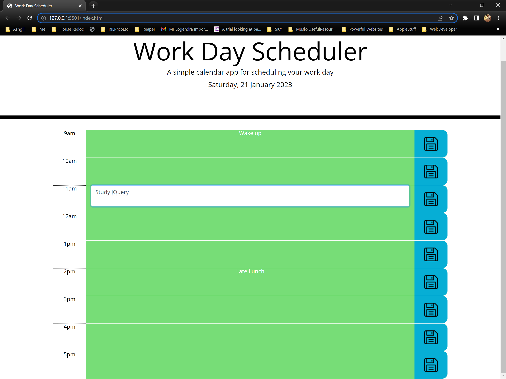

# Work_Day_Scheduler

## Table of contents

- [Overview](#overview)
  - [The challenge](#the-challenge)
  - [Screenshot](#screenshot)
  - [Links](#links)
- [My process](#my-process)
  - [Built with](#built-with)
  - [What I learned](#what-i-learned)
  - [Continued development](#continued-development)
  - [Useful resources](#useful-resources)
- [Author](#author)
- [Acknowledgments](#acknowledgments)


## Overview

- A simple calendar application that allows a user to save events for each hour of the day


### The challenge

* Display the current day at the top of the calender when a user opens the planner.
 
* Present timeblocks for standard business hours when the user scrolls down.
 
* Color-code each timeblock based on past, present, and future when the timeblock is viewed.
 
* Allow a user to enter an event when they click a timeblock

* Save the event in local storage when the save button is clicked in that timeblock.

* Persist events between refreshes of a page

### Screenshot




### Links

- Solution URL: [https://github.com/EDX-IL/Work_Day_Scheduler](https://your-solution-url.com)
- Live Site URL: [https://edx-il.github.io/Work_Day_Scheduler/](https://your-live-site-url.com)

## My process

### Built with

- Semantic HTML5 markup
- CSS custom properties
- FlexBox
- Javascript
- JScript
- JQuery


### What I learned

- How to use JQuery to create dynamic HTML 
- How to pass and query the event object
- How to store / retrieve from local storage


This uses the event passed by the Save button click to get the relevent event info and then stores it to local storage
```js
 //function to save event to local storage
function fncSaveEvent(event) {
   //use which save button was pressed as key for localstorage
  let localStorageKey = $(event.target).data("save");
  //use the button that was pressed (localStorageKey) to get data/text from same row data-event
  let eventData = $(`[data-event=${localStorageKey}]`).text();
  //save above 2 to localstorage
  localStorage.setItem(localStorageKey, eventData);
}
```
This sets the color of the row based on the ID of the row and whether it's in the past present or future. The template literal and string interpolation are a tidy way of accessing elements
```js
for (let index = sbStartHour; index <= sbEndHour; index++) {
    //hourIndex is the 24hr number of current hour
    let hourIndex = parseInt(moment().format("kk"));

    //Past
    if (index < hourIndex) {
      $(`.row[data-row=${index}]`).addClass("past");
    }
    //Present
    else if (index == hourIndex) {
      $(`.row[data-row=${index}]`).addClass("present");
    } 
    //Future
    else {
      $(`.row[data-row=${index}]`).addClass("future");
    }
  }
```


### Continued development

I would like to further my knowledge of JQuery as it's widely used and very powerful.


### Useful resources

- [Date Prototype](https://developer.mozilla.org/en-US/docs/Web/JavaScript/Reference/Global_Objects/Date/toLocaleDateString) - This helped me to format the date natively in javascript rather than using a library. 
- [Template Literal](https://developer.mozilla.org/en-US/docs/Web/JavaScript/Reference/Template_literals) - Very useful concept when working with strings which is the case with data-id set with an index.
- [Local Storage](https://www.w3schools.com/jsref/prop_win_localstorage.asp) - Useful reference document on how save and retrieve to local storage.
- [JQuery Event Object](https://api.jquery.com/category/events/event-object/) - Use resource to know to how query the event data that was passed when a button was clicked.


## Author
 Ian Logendra
- GitHub - [EDX-IL](https://github.com/EDX-IL)


## Acknowledgments

- Noah (TA) - Tremendous help. I spent 2 days with the QuerySelector running once at the beginning (rather than before it was needed which meant there were no attributes to read!), and also was able to explain how to use JQuery methods to create HTML rather than using the string concatenation way i'd used.
- Andrew (TA) - Excellent help diagnosing an issue with Live Server not reloading correctly and showing me template literals as way of accessing the defined data-ids
- Scott (TA)

